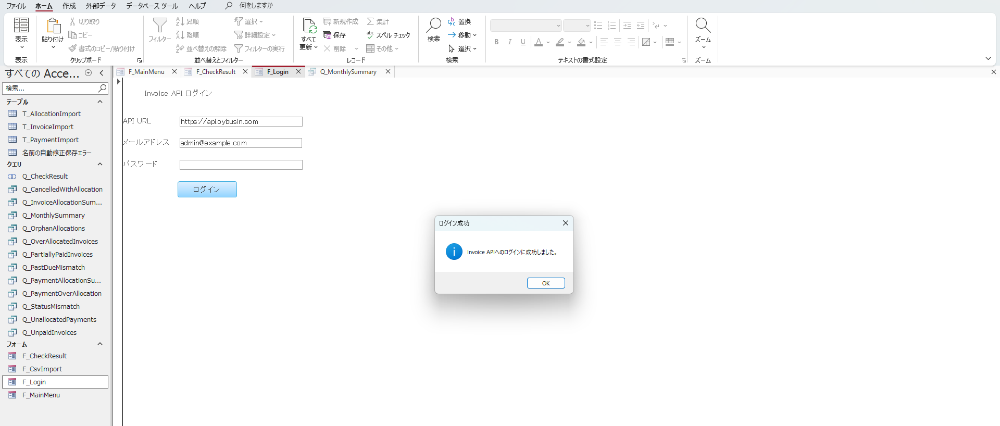
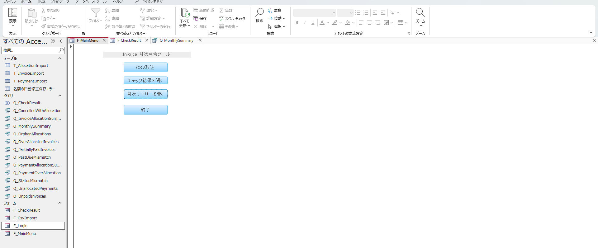
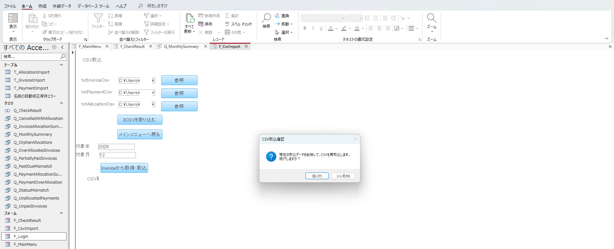
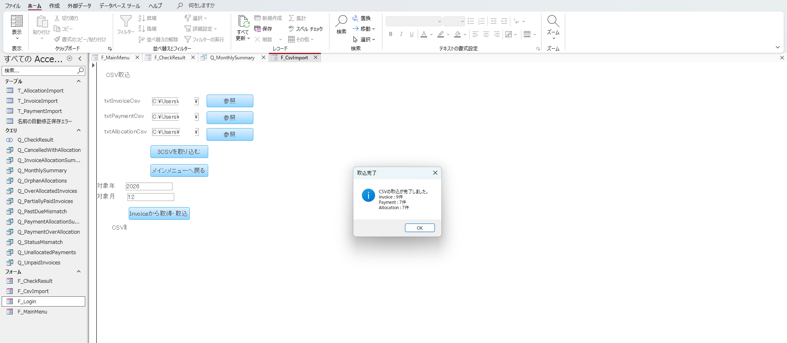
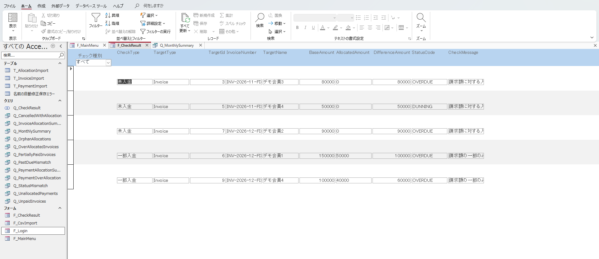
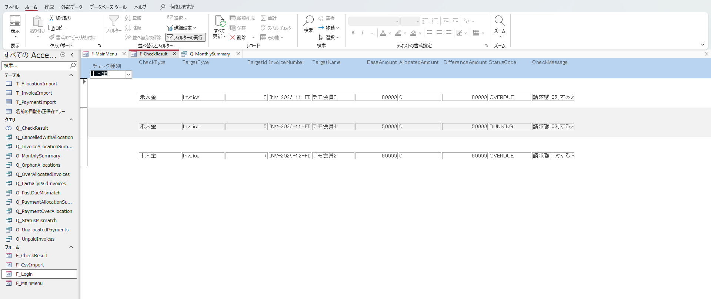
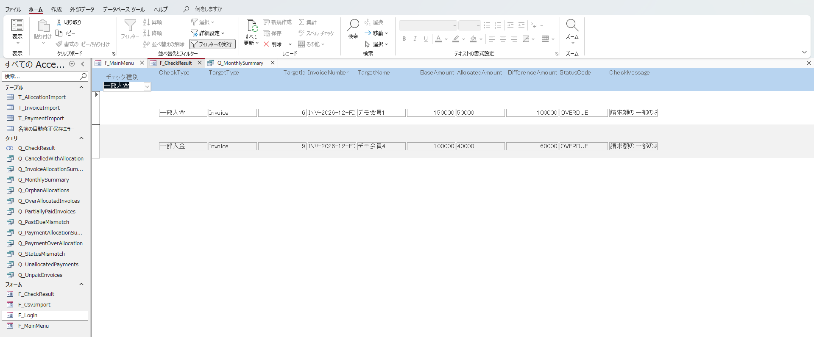
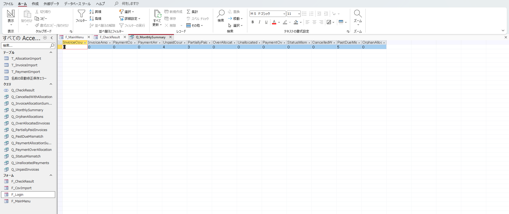

# Invoice Access Operations Tool

Microsoft Access / VBA / Access SQL を利用した、**請求・入金データの月次照合／チェック用業務支援ツール**です。

既存の **Invoice Management System** を正データの管理主体とし、Access 側では請求・入金・入金割当のデータを取り込み、元データから再集計して不整合や確認対象を抽出します。

本ツールから Invoice Management System の DB を直接更新することはありません。

---

## 概要

Invoice Management System には、請求・入金・入金割当を管理する既存機能があります。

本ツールはそれらの CRUD を Access で再実装するものではなく、月次確認時に必要となる以下の処理を補助するための周辺ツールです。

- 請求額と入金割当額の照合
- 未入金・一部入金の抽出
- 請求額を超える過剰割当の検出
- 入金額と割当額の照合
- 未割当・一部未割当入金の抽出
- 入金額を超える割当の検出
- Invoice 本体ステータスとの不整合確認
- キャンセル済み請求への割当確認
- 期限超過状態の不整合確認
- 参照不整合の確認
- 月次サマリーの表示

また、手動 CSV 取込に加えて、Invoice API へログインし、対象年月の照合用データを **ZIP 取得 → 展開 → Access 取込** まで実行できるようにしています。

---

## システム構成

```text
┌──────────────────────────────┐
│ Microsoft Access             │
│ Invoice Access Operations    │
│                              │
│ F_Login                      │
│ F_CsvImport                  │
│ F_CheckResult                │
│ Q_MonthlySummary             │
└──────────────┬───────────────┘
               │ HTTPS
               │ JWT Bearer
               ▼
┌──────────────────────────────┐
│ nginx                        │
│ ConoHa VPS                   │
└──────────────┬───────────────┘
               │
               ▼
┌──────────────────────────────┐
│ Invoice Management System    │
│ ASP.NET Core API             │
│                              │
│ POST /auth/login             │
│ GET /api/admin/access-export │
└──────────────┬───────────────┘
               │
               ▼
┌──────────────────────────────┐
│ PostgreSQL                   │
│ Invoice / Payment /          │
│ PaymentAllocation            │
└──────────────────────────────┘
```

Access から Invoice DB へ直接接続しません。

データ連携は Invoice API が生成した CSV / ZIP を介した **一方向連携**です。

---

## 処理フロー

### API 自動連携

```text
F_Login
  │
  │ POST /auth/login
  ▼
Admin JWT 取得
  │
  │ TempVars に保持
  ▼
F_CsvImport
  │
  │ 対象年 / 対象月を指定
  ▼
[Invoiceから取得・取込]
  │
  │ GET /api/admin/access-export
  │     ?year=YYYY
  │     &month=MM
  ▼
invoice-access-YYYYMM.zip
  │
  ▼
PowerShell Expand-Archive
  │
  ├─ invoices_YYYYMM.csv
  ├─ payments_YYYYMM.csv
  └─ allocations_YYYYMM.csv
  │
  ▼
Access Import Table
  │
  ├─ T_InvoiceImport
  ├─ T_PaymentImport
  └─ T_AllocationImport
  │
  ▼
Access Query
  │
  ├─ 請求照合
  ├─ 入金照合
  ├─ 不整合チェック
  └─ 月次集計
```

### 手動取込

API を利用しない場合は、3CSV を個別に指定して取り込むこともできます。

このため、以下の2系統を用意しています。

```text
1. Invoice API から取得・取込
2. ローカル CSV を手動指定して取込
```

---

## Access Export API

### Endpoint

```http
GET /api/admin/access-export?year={year}&month={month}
```

管理者のみ実行可能です。

Access 側では先にログイン API を呼び出し、取得した JWT を Bearer Token として送信します。

```http
Authorization: Bearer {token}
```

### Response

正常時は ZIP を返します。

```text
invoice-access-YYYYMM.zip
│
├─ invoices_YYYYMM.csv
├─ payments_YYYYMM.csv
└─ allocations_YYYYMM.csv
```

CSV は同一の対象年月を基準とした 1 セットとして扱います。

---

## CSV 仕様

共通仕様：

| 項目 | 仕様 |
|---|---|
| 文字コード | UTF-8 BOM付き |
| 区切り | カンマ |
| 改行 | CRLF |
| ヘッダー | あり |
| NULL | 空文字 |
| 日付 | `yyyy-MM-dd` |
| 金額 | 小数点形式、桁区切りなし |

Access 側では UTF-8 として明示して取り込みます。

```vb
DoCmd.TransferText _
    TransferType:=acImportDelim, _
    TableName:="T_InvoiceImport", _
    FileName:=CStr(Me.txtInvoiceCsv.Value), _
    HasFieldNames:=True, _
    CodePage:=65001
```

---

## 取込テーブル

### T_InvoiceImport

主な項目：

```text
InvoiceId
MemberId
InvoiceNumber
InvoiceDate
DueDate
TotalAmount
StatusCode
StatusName
IsOverdue
IsClosed
MemberName
```

### T_PaymentImport

主な項目：

```text
PaymentId
MemberId
PaymentDate
Amount
PayerName
Method
```

### T_AllocationImport

主な項目：

```text
AllocationId
PaymentId
InvoiceId
Amount
```

再取込時は、既存の Import Table をクリアしてから 3CSV を取り込みます。

削除順は参照関係を考慮し、

```text
T_AllocationImport
  ↓
T_PaymentImport
  ↓
T_InvoiceImport
```

としています。

---

## 照合ロジック

### 請求単位

InvoiceId 単位で Allocation.Amount を集計します。

```text
AllocatedAmount
    = SUM(T_AllocationImport.Amount)
      GROUP BY InvoiceId
```

判定：

| 条件 | 判定 |
|---|---|
| `AllocatedAmount = 0` | 未入金 |
| `0 < AllocatedAmount < TotalAmount` | 一部入金 |
| `AllocatedAmount = TotalAmount` | 入金済 |
| `AllocatedAmount > TotalAmount` | 過剰割当 |

差額：

```text
RemainingAmount
    = TotalAmount - AllocatedAmount
```

### 入金単位

PaymentId 単位で Allocation.Amount を集計します。

```text
AllocatedAmount
    = SUM(T_AllocationImport.Amount)
      GROUP BY PaymentId
```

判定：

| 条件 | 判定 |
|---|---|
| `AllocatedAmount = 0` | 未割当 |
| `0 < AllocatedAmount < Payment.Amount` | 一部未割当 |
| `AllocatedAmount = Payment.Amount` | 割当完了 |
| `AllocatedAmount > Payment.Amount` | 割当額超過 |

未割当額：

```text
UnallocatedAmount
    = Payment.Amount - AllocatedAmount
```

---

## 主な Query

| Query | 用途 |
|---|---|
| `Q_InvoiceAllocationSummary` | 請求単位の割当額集計 |
| `Q_PaymentAllocationSummary` | 入金単位の割当額集計 |
| `Q_UnpaidInvoices` | 未入金請求 |
| `Q_PartiallyPaidInvoices` | 一部入金請求 |
| `Q_OverAllocatedInvoices` | 請求額超過割当 |
| `Q_UnallocatedPayments` | 未割当・一部未割当入金 |
| `Q_PaymentOverAllocation` | 入金額超過割当 |
| `Q_OrphanAllocations` | 参照不整合 |
| `Q_StatusMismatch` | Invoice ステータスとの不整合 |
| `Q_CancelledWithAllocation` | キャンセル済み請求への割当 |
| `Q_PastDueMismatch` | 期限超過状態の不整合 |
| `Q_CheckResult` | 確認対象の一覧表示用 |
| `Q_MonthlySummary` | 月次サマリー |

`Q_CheckResult` は、現段階では主に以下のチェック結果を一覧化します。

```text
未入金
一部入金
過剰割当
未割当入金
入金割当超過
```

ステータス不整合、キャンセル請求への割当、期限超過不整合、参照不整合は個別 Query および月次サマリー側で確認できます。

---

## 画面

### F_Login

Invoice API の Base URL、メールアドレス、パスワードを入力し、Admin ログインします。

ログイン成功後は JWT と API Base URL を `TempVars` に保持し、パスワードは保持しません。



### F_MainMenu

CSV取込、チェック結果、月次サマリーへの入口です。



### F_CsvImport

手動 CSV 指定に加えて、対象年月を指定し、Invoice API から ZIP を取得できます。

「Invoiceから取得・取込」では以下を自動実行します。

```text
API取得
  ↓
ZIP保存
  ↓
ZIP展開
  ↓
3CSVパス設定
  ↓
既存Importデータ削除
  ↓
UTF-8 CSV取込
  ↓
件数表示
```



本番 VPS 上の Invoice API から取得し、Access へ取り込む E2E 動作を確認しています。



### F_CheckResult

確認対象を一覧表示し、チェック種別で絞り込めます。







### Q_MonthlySummary

請求・入金件数、金額、各チェック件数を月次確認用に集計します。



---

## 動作確認済み構成

現段階では以下の経路で動作確認しています。

```text
Microsoft Access
  ↓ HTTPS
nginx
  ↓
ASP.NET Core API
  ↓
PostgreSQL
```

確認済み内容：

- Admin ログイン
- JWT 取得
- Access Export API 呼出
- ZIP ダウンロード
- ZIP 自動展開
- 3CSV のパス自動設定
- UTF-8 CSV 取込
- Invoice / Payment / Allocation 件数確認
- チェック結果表示
- 月次サマリー表示
- ConoHa VPS 上の API との E2E 接続

---

## 使用技術

### Access 側

- Microsoft Access
- VBA
- Access SQL
- DAO / `CurrentDb`
- `DoCmd.TransferText`
- `WinHttp.WinHttpRequest.5.1`
- `ADODB.Stream`
- `WScript.Shell`
- PowerShell `Expand-Archive`

### Invoice Management System 側

- ASP.NET Core / .NET
- Entity Framework Core
- PostgreSQL
- JWT Bearer Authentication
- Admin Role Authorization
- Docker / Docker Compose
- nginx
- HTTPS
- ConoHa VPS

---

## 設計上のポイント

### 1. Invoice Management System を正データとする

Access は請求・入金の登録システムではありません。

```text
Invoice Management System
    = 正データ

Access
    = 月次照合・確認
```

Access から Invoice DB を直接更新しません。

### 2. 派生値を API から渡しすぎない

`PaidAmount` や `RemainingAmount` などをそのまま CSV に含めるのではなく、Access 側で PaymentAllocation から再計算します。

これにより、Access を単なる CSV 閲覧ツールではなく、元データを使った照合ツールとして分離しています。

### 3. Invoice / Payment / Allocation を分離して出力する

既存の Sales Export とは用途を分離しています。

```text
Sales Export
    → 人が売上・入金状況を確認するための一覧

Access Export
    → Access が元データから再計算・照合するためのデータ
```

### 4. API と手動 CSV の両方に対応する

API が利用できない場合でも、3CSV を手動指定して取り込める経路を残しています。

---

## 制約事項

### 過去時点の完全再現は行わない

現在の PaymentAllocation は、割当作成日時そのものを履歴として保持する前提ではありません。

そのため、本ツールは

```text
指定した過去月の状態を完全に復元する会計スナップショット
```

ではなく、

```text
Export 実行時点の現在データを、
指定年月を基準として照合する業務支援ツール
```

として位置付けています。

### Access から Invoice 側への更新は行わない

以下は対象外です。

- Invoice の登録・更新
- Payment の登録・更新
- PaymentAllocation の登録・更新
- Invoice ステータス更新
- Invoice DB への直接接続
- 月次締めロック
- 会計仕訳
- 過去任意日時の完全状態復元
- 複数ユーザーによる同時更新

---

## 現段階で未実装 / 今後の拡張

設計上は月次確認レポート `R_MonthlyCheck` を想定していますが、現段階の実装・動作確認は **チェック結果一覧と `Q_MonthlySummary` まで**です。

今後の候補：

- `R_MonthlyCheck` の実装
- 取込エラー時の staging table 化
- CSV 取込履歴の世代管理
- 取込日時・対象年月の履歴保存
- チェック結果一覧への追加判定統合
- API エラー表示の改善

---

## 設計ドキュメント

| 文書 | 内容 |
|---|---|
| [`docs/01_requirements.md`](docs/01_requirements.md) | 要件定義、対象範囲、照合要件、非機能要件 |
| [`docs/02_basic_design.md`](docs/02_basic_design.md) | Access Export API、ZIP / CSV、抽出条件、照合ルール |
| [`docs/03_detail_design.md`](docs/03_detail_design.md) | Endpoint / Service / DTO / CSV Builder / ZIP Builder の詳細設計 |

---

## 主要ファイル

```text
invoice-access-operations-tool/
│
├─ README.md
│
├─ access/
│  └─ InvoiceAccessOperations.accdb
│
└─ docs/
   ├─ 01_requirements.md
   ├─ 02_basic_design.md
   ├─ 03_detail_design.md
   │
   └─ images/
      ├─ 01-api-login.png
      ├─ 02-main-menu.png
      ├─ 03-csv-import.png
      ├─ 04-csv-import-complete.png
      ├─ 05-check-result-1.png
      ├─ 06-check-result-2.png
      ├─ 07-check-result-3.png
      └─ 08-monthly-summary.png
```

---

## 関連システム

本ツールの Access Export API は、既存の **Invoice Management System** 側に追加した機能です。

API 側では以下の責務を分離しています。

```text
AccessExportEndpoints
        ↓
AccessExportQuery
        ↓
IAccessExportService
        ↑
AccessExportService
        ↓
AppDbContext
        ↓
AccessExportDataDto
        ↓
AccessExportCsvBuilder
        ↓
AccessExportZipBuilder
        ↓
application/zip
```

Access 側は、返却された元データを基に照合処理を担当します。

---

## 位置付け

このリポジトリでは、Access のフォーム・クエリ・VBAだけでなく、

```text
ASP.NET Core API
  +
JWT認証
  +
ZIP / CSV連携
  +
VBA
  +
Access SQL
  +
VPS / Docker / nginx
```

を組み合わせ、既存業務システムに対する **EUC / 月次照合ツールの設計・実装例**としてまとめています。
