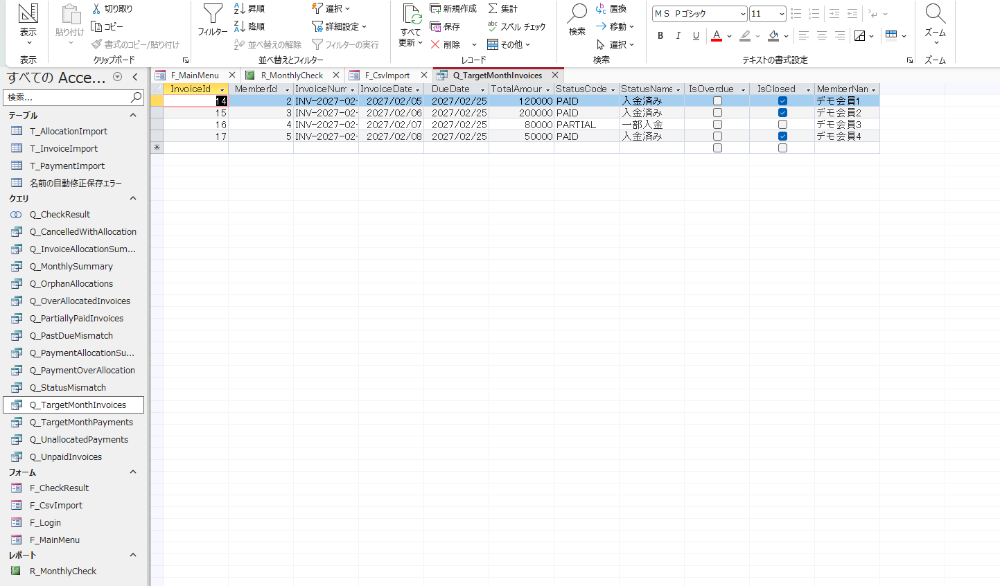
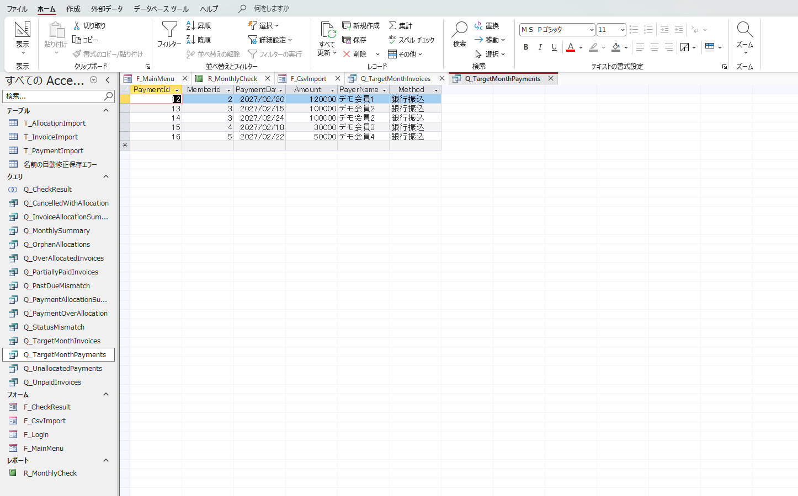
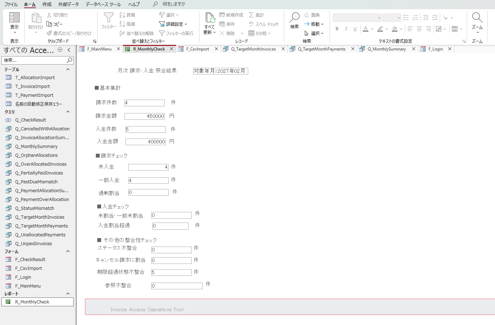
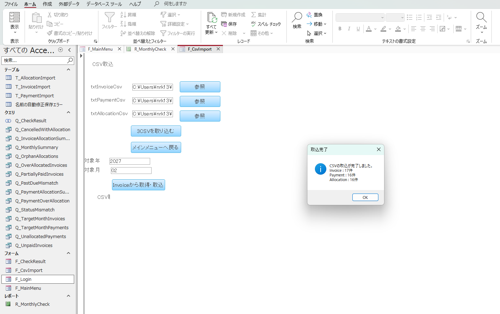

# Invoice Access Operations Tool

Microsoft Access / VBA / Access SQL を利用した、**請求・入金データの月次照合／チェック用業務支援ツール**です。

既存の **Invoice Management System** を正データの管理主体とし、Access 側では請求・入金・入金割当の元データを取り込み、再集計して確認対象や不整合を抽出します。

Access から Invoice Management System の DB を直接更新することはありません。

**Phase 1 は、Admin JWTログイン → Access Export API → ZIP/3CSV取得 → Access自動取込 → 照合 → 対象月集計 → 月次確認レポートまで実装・E2E動作確認済みです。**

---

## 概要

Invoice Management System には、請求・入金・入金割当を管理する既存機能があります。

本ツールはそれらの CRUD を Access で再実装するものではなく、月次確認時に必要となる以下の処理を補助する周辺ツールです。

- 請求額と入金割当額の照合
- 未入金・一部入金の抽出
- 請求額を超える過剰割当の検出
- 入金額と割当額の照合
- 未割当・一部未割当入金の抽出
- 入金額を超える割当の検出
- Invoice 本体ステータスとの不整合確認
- キャンセル済み請求への割当確認
- 期限超過状態の不整合確認
- 参照不整合の確認
- 対象年月の請求・入金基本集計
- 月次サマリー表示
- 1ページの月次確認レポート表示

手動 CSV 取込に加え、Invoice API へログインし、対象年月の照合用データを **ZIP取得 → 展開 → Access取込** まで1操作で実行できます。

---

## システム構成

```text
┌──────────────────────────────┐
│ Microsoft Access             │
│ Invoice Access Operations    │
│                              │
│ F_Login                      │
│ F_MainMenu                   │
│ F_CsvImport                  │
│ F_CheckResult                │
│ Q_TargetMonthInvoices        │
│ Q_TargetMonthPayments        │
│ Q_MonthlySummary             │
│ R_MonthlyCheck               │
└──────────────┬───────────────┘
               │ HTTPS
               │ JWT Bearer
               ▼
┌──────────────────────────────┐
│ nginx / ConoHa VPS           │
└──────────────┬───────────────┘
               │
               ▼
┌──────────────────────────────┐
│ Invoice Management System    │
│ ASP.NET Core API             │
│                              │
│ POST /auth/login             │
│ GET /api/admin/access-export │
└──────────────┬───────────────┘
               │
               ▼
┌──────────────────────────────┐
│ PostgreSQL                   │
│ Invoice / Payment /          │
│ PaymentAllocation            │
└──────────────────────────────┘
```

Access から Invoice DB へ直接接続しません。

データ連携は Invoice API が生成した CSV / ZIP を介した **一方向連携**です。

---

## 処理フロー

### API 自動連携

```text
F_Login
  │
  │ POST /auth/login
  ▼
Admin JWT 取得
  │
  │ AccessToken / ApiBaseUrl を TempVars に保持
  ▼
F_MainMenu
  │
  ▼
F_CsvImport
  │
  │ TargetYear / TargetMonth
  │ 対象年月を TempVars に保持
  ▼
[Invoiceから取得・取込]
  │
  │ GET /api/admin/access-export
  │     ?year=YYYY
  │     &month=MM
  ▼
invoice-access-YYYYMM.zip
  │
  ▼
PowerShell Expand-Archive
  │
  ├─ invoices_YYYYMM.csv
  ├─ payments_YYYYMM.csv
  └─ allocations_YYYYMM.csv
  │
  ▼
Access Import Table
  │
  ├─ T_InvoiceImport
  ├─ T_PaymentImport
  └─ T_AllocationImport
  │
  ├─ 照合Query
  ├─ Q_TargetMonthInvoices
  └─ Q_TargetMonthPayments
  │
  ▼
Q_MonthlySummary
  │
  ▼
R_MonthlyCheck
```

### 手動取込

API を利用しない場合は、3CSV を個別に指定して取り込むこともできます。

```text
1. Invoice API から取得・取込
2. ローカル CSV を手動指定して取込
```

どちらも同じ Import Table と照合 Query を使用します。

---

## Access Export API

### Endpoint

```http
GET /api/admin/access-export?year={year}&month={month}
```

管理者のみ実行可能です。

Access 側では先にログイン API を呼び出し、取得した JWT を Bearer Token として送信します。

```http
Authorization: Bearer {token}
```

### Response

正常時は ZIP を返します。

```text
invoice-access-YYYYMM.zip
│
├─ invoices_YYYYMM.csv
├─ payments_YYYYMM.csv
└─ allocations_YYYYMM.csv
```

CSV は同一の対象年月を基準とした1セットとして扱います。

---

## CSV 仕様

| 項目 | 仕様 |
|---|---|
| 文字コード | UTF-8 BOM付き |
| 区切り | カンマ |
| 改行 | CRLF |
| ヘッダー | あり |
| NULL | 空文字 |
| 日付 | `yyyy-MM-dd` |
| 金額 | 小数点形式、桁区切りなし |

Access 側では UTF-8 として明示して取り込みます。

```vb
DoCmd.TransferText _
    TransferType:=acImportDelim, _
    TableName:="T_InvoiceImport", _
    FileName:=CStr(Me.txtInvoiceCsv.Value), _
    HasFieldNames:=True, _
    CodePage:=65001
```

---

## 取込テーブル

### T_InvoiceImport

```text
InvoiceId
MemberId
InvoiceNumber
InvoiceDate
DueDate
TotalAmount
StatusCode
StatusName
IsOverdue
IsClosed
MemberName
```

### T_PaymentImport

```text
PaymentId
MemberId
PaymentDate
Amount
PayerName
Method
```

### T_AllocationImport

```text
AllocationId
PaymentId
InvoiceId
Amount
```

再取込時は、参照関係を考慮して次の順に既存データを削除します。

```text
T_AllocationImport
  ↓
T_PaymentImport
  ↓
T_InvoiceImport
```

---

## 対象年月の扱い

Access Export は「対象月に新規作成されたデータだけ」ではなく、対象月末の照合に必要な過去分を含む累積データを返します。

そのため、月次の基本集計用に以下の2 Query を分離しています。

```text
Q_TargetMonthInvoices
Q_TargetMonthPayments
```

対象年月は `F_CsvImport` の入力値を `TempVars` に保持します。

```text
TargetYear
TargetMonth
```

### Q_TargetMonthInvoices

```text
InvoiceDate >= 対象月1日
AND
InvoiceDate < 翌月1日
```

### Q_TargetMonthPayments

```text
PaymentDate >= 対象月1日
AND
PaymentDate < 翌月1日
```

これにより、取込スナップショット全体と、対象月の基本集計を分離しています。

---

## 照合ロジック

### 請求単位

InvoiceId 単位で Allocation.Amount を集計します。

```text
AllocatedAmount
    = SUM(T_AllocationImport.Amount)
      GROUP BY InvoiceId
```

| 条件 | 判定 |
|---|---|
| `AllocatedAmount = 0` | 未入金 |
| `0 < AllocatedAmount < TotalAmount` | 一部入金 |
| `AllocatedAmount = TotalAmount` | 入金済 |
| `AllocatedAmount > TotalAmount` | 過剰割当 |

```text
RemainingAmount
    = TotalAmount - AllocatedAmount
```

### 入金単位

PaymentId 単位で Allocation.Amount を集計します。

```text
AllocatedAmount
    = SUM(T_AllocationImport.Amount)
      GROUP BY PaymentId
```

| 条件 | 判定 |
|---|---|
| `AllocatedAmount = 0` | 未割当 |
| `0 < AllocatedAmount < Payment.Amount` | 一部未割当 |
| `AllocatedAmount = Payment.Amount` | 割当完了 |
| `AllocatedAmount > Payment.Amount` | 割当額超過 |

```text
UnallocatedAmount
    = Payment.Amount - AllocatedAmount
```

---

## 主な Query

| Query | 用途 |
|---|---|
| `Q_InvoiceAllocationSummary` | 請求単位の割当額集計 |
| `Q_PaymentAllocationSummary` | 入金単位の割当額集計 |
| `Q_UnpaidInvoices` | 未入金請求 |
| `Q_PartiallyPaidInvoices` | 一部入金請求 |
| `Q_OverAllocatedInvoices` | 請求額超過割当 |
| `Q_UnallocatedPayments` | 未割当・一部未割当入金 |
| `Q_PaymentOverAllocation` | 入金額超過割当 |
| `Q_OrphanAllocations` | 参照不整合 |
| `Q_StatusMismatch` | Invoice ステータスとの不整合 |
| `Q_CancelledWithAllocation` | キャンセル済み請求への割当 |
| `Q_PastDueMismatch` | 期限超過状態の不整合 |
| `Q_TargetMonthInvoices` | 対象月Invoice抽出 |
| `Q_TargetMonthPayments` | 対象月Payment抽出 |
| `Q_CheckResult` | 確認対象一覧 |
| `Q_MonthlySummary` | 月次基本集計・照合件数 |

`Q_CheckResult` は主に以下を一覧化します。

```text
未入金
一部入金
過剰割当
未割当入金
入金割当超過
```

ステータス不整合、キャンセル請求への割当、期限超過不整合、参照不整合は個別 Query と月次サマリーで確認します。

---

## Q_MonthlySummary

`Q_MonthlySummary` は1レコードを返します。

基本集計：

| 項目 | 参照元 |
|---|---|
| InvoiceCount | `Q_TargetMonthInvoices` |
| InvoiceAmount | `Q_TargetMonthInvoices`（CANCELLED除外） |
| PaymentCount | `Q_TargetMonthPayments` |
| PaymentAmount | `Q_TargetMonthPayments` |

照合件数は取込スナップショット全体の確認 Query を参照します。

```text
UnpaidCount
PartiallyPaidCount
OverAllocatedInvoiceCount
UnallocatedPaymentCount
PaymentOverAllocationCount
StatusMismatchCount
CancelledWithAllocationCount
PastDueMismatchCount
OrphanAllocationCount
```


---

## 画面・レポート

### F_Login

Invoice API の Base URL、メールアドレス、パスワードを入力し、Admin ログインします。

ログイン成功後は JWT と API Base URL を `TempVars` に保持します。

パスワードは保持せず、ログイン成功後に入力欄をクリアします。


### F_MainMenu

CSV取込、チェック結果、月次サマリー、月次確認レポートへの入口です。


### F_CsvImport

手動 CSV 指定に加えて、対象年月を指定し、Invoice API から ZIP を取得できます。

「Invoiceから取得・取込」では以下を自動実行します。

```text
API取得
  ↓
ZIP保存
  ↓
ZIP展開
  ↓
3CSVパス設定
  ↓
既存Importデータ削除
  ↓
UTF-8 CSV取込
  ↓
件数表示
```


### F_CheckResult

確認対象を一覧表示し、チェック種別で絞り込めます。


### Q_TargetMonthInvoices

対象月に発生した請求を抽出します。



### Q_TargetMonthPayments

対象月に発生した入金を抽出します。



### R_MonthlyCheck

`Q_MonthlySummary` をレコードソースにした1ページの月次確認レポートです。

対象年月、基本集計、請求チェック、入金チェック、その他の整合性チェックをまとめて表示します。



---

## 動作確認済み構成

```text
Microsoft Access
  ↓ HTTPS
nginx
  ↓
ASP.NET Core API
  ↓
PostgreSQL
```

確認済み内容：

- Admin ログイン
- JWT 取得
- Access Export API 呼出
- ZIP ダウンロード
- ZIP 自動展開
- 3CSV のパス自動設定
- UTF-8 CSV 取込
- Invoice / Payment / Allocation 件数確認
- チェック結果表示
- 対象月抽出
- 月次サマリー表示
- 月次確認レポート表示
- ConoHa VPS 上の API との E2E 接続

### 2027年2月 動作確認例

```text
Import Snapshot
Invoice    : 17件
Payment    : 16件
Allocation : 16件

Target Month
InvoiceCount  : 4件
InvoiceAmount : 450000
PaymentCount  : 5件
PaymentAmount : 400000
```

`Q_TargetMonthInvoices` / `Q_TargetMonthPayments` と、`Q_MonthlySummary` / `R_MonthlyCheck` の基本集計が一致することを確認しています。



---

## 使用技術

### Access 側

- Microsoft Access
- VBA
- Access SQL
- DAO / `CurrentDb`
- `DoCmd.TransferText`
- `WinHttp.WinHttpRequest.5.1`
- `ADODB.Stream`
- `WScript.Shell`
- PowerShell `Expand-Archive`

### Invoice Management System 側

- ASP.NET Core / .NET
- Entity Framework Core
- PostgreSQL
- JWT Bearer Authentication
- Admin Role Authorization
- Docker / Docker Compose
- nginx
- HTTPS
- ConoHa VPS

---

## 設計上のポイント

### 1. Invoice Management System を正データとする

```text
Invoice Management System
    = 正データ

Microsoft Access
    = 月次照合・確認
```

Access から Invoice DB を直接更新しません。

### 2. 派生値を API から渡しすぎない

`PaidAmount` や `RemainingAmount` 等を完成値として渡すのではなく、Access 側で PaymentAllocation から再計算します。

これにより、Access を単なる CSV 閲覧ツールではなく、元データを用いた照合ツールとして分離しています。

### 3. Invoice / Payment / Allocation を分離して出力する

```text
Sales Export
    → 人が売上・入金状況を確認するための一覧

Access Export
    → Access が元データから再計算・照合するためのデータ
```

### 4. スナップショット全体と対象月集計を分離する

Access Export は照合に必要な累積データを出力します。

一方、請求件数・請求金額・入金件数・入金金額は `Q_TargetMonthInvoices` / `Q_TargetMonthPayments` で対象年月だけに絞り込みます。

### 5. API と手動 CSV の両方に対応する

API が利用できない場合でも、3CSV を手動指定して同じ照合処理を利用できます。

---

## 制約事項

### 過去時点の完全再現は行わない

現在の PaymentAllocation は、割当作成日時そのものを履歴として保持する前提ではありません。

そのため、本ツールは、

```text
指定した過去月の状態を完全に復元する会計スナップショット
```

ではなく、

```text
Export 実行時点の現在データを、
指定年月を基準として照合する業務支援ツール
```

として位置付けています。

### Access から Invoice 側への更新は行わない

以下は対象外です。

- Invoice の登録・更新
- Payment の登録・更新
- PaymentAllocation の登録・更新
- Invoice ステータス更新
- Invoice DB への直接接続
- 月次締めロック
- 会計仕訳
- 過去任意日時の完全状態復元
- 複数ユーザーによる同時更新

---

## 今後の拡張候補

Phase 1 の主要機能は完成しています。

今後の候補：

- 取込エラー時の staging table 化
- CSV 取込履歴の世代管理
- 取込日時・対象年月の履歴保存
- `Q_CheckResult` への追加判定統合
- レポートのPDF出力等、運用向け出力機能

---

## 設計ドキュメント

| 文書 | 内容 |
|---|---|
| [`docs/01_requirements.md`](docs/01_requirements.md) | 要件定義、対象範囲、照合要件、レポート要件、完成条件 |
| [`docs/02_basic_design.md`](docs/02_basic_design.md) | API、ZIP / CSV、Access連携、対象月集計、月次レポート |
| [`docs/03_detail_design.md`](docs/03_detail_design.md) | Endpoint / Service / DTO / VBA / Query / Report の詳細設計 |

---

## 主要ファイル

```text
invoice-access-operations-tool/
│
├─ README.md
│
├─ access/
│  └─ InvoiceAccessOperations.accdb
│
└─ docs/
   ├─ 01_requirements.md
   ├─ 02_basic_design.md
   ├─ 03_detail_design.md
   │
   └─ images/
      ├─ 01-api-login.png
      ├─ 02-main-menu.png
      ├─ 03-csv-import.png
      ├─ 04-csv-import-complete.png
      ├─ 05-check-result-1.png
      ├─ 06-check-result-2.png
      ├─ 07-check-result-3.png
      ├─ 08-monthly-summary.png
      ├─ 09-target-month-invoices.png
      ├─ 10-target-month-payments.png
      ├─ 11-monthly-report.png
      └─ 12-202702-import.png
```

---

## 関連システム

本ツールの Access Export API は、既存の **Invoice Management System** 側に追加した機能です。

```text
AccessExportEndpoints
        ↓
AccessExportQuery
        ↓
IAccessExportService
        ↑
AccessExportService
        ↓
AppDbContext
        ↓
AccessExportDataDto
        ↓
AccessExportCsvBuilder
        ↓
AccessExportZipBuilder
        ↓
application/zip
```

Access 側は返却された元データを基に、取込・再集計・不整合確認・月次レポートを担当します。

---

## 位置付け

このリポジトリでは、

```text
ASP.NET Core API
  +
JWT認証
  +
ZIP / CSV連携
  +
VBA
  +
Access SQL
  +
月次照合レポート
  +
VPS / Docker / nginx
```

を組み合わせ、既存業務システムに対する **EUC / 月次照合ツールの設計・実装例**としてまとめています。
